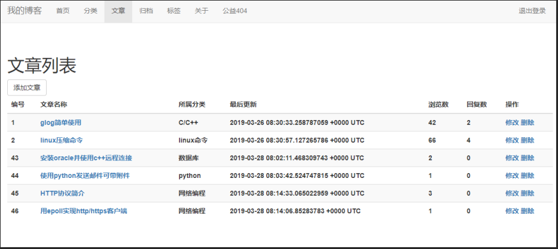
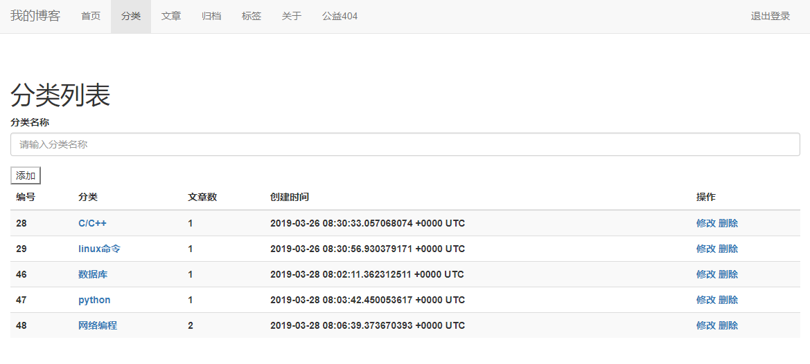
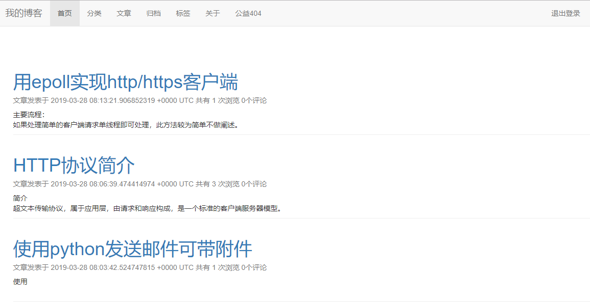

使用go语言开发的一个简易博客  一般博客常用功能基本上支持了

# 框架

使用beego框架开发

# 数据库

数据库使用sqlite github.com/mattn/go-sqlite3

# 启动：
默认启在前台

使用-b参数启在后台

# 使用库:

github.com/astaxie/beego

github.com/Unknwon/com

github.com/mattn/go-sqlite3

# 部分效果如下

文章

分类

首页

